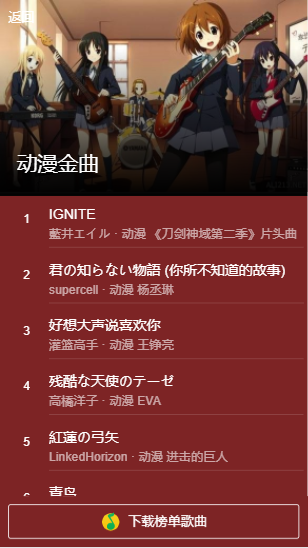

>一个vue2的项目 


``` bash
# 安装项目
git clone https://github.com/juntaozhou05/qqmusic.git

# 安装项目依赖
npm i

# 运行开发
npm run dev

# 运行生产环境
npm run build
```

[预览地址](http://www.juntaozhou.cn/music/#/recom)(请模拟手机端浏览)

json数据就在项目文件夹里，是网上扒下来的，可能有些链接过期了。

#项目相关图片


  

  
